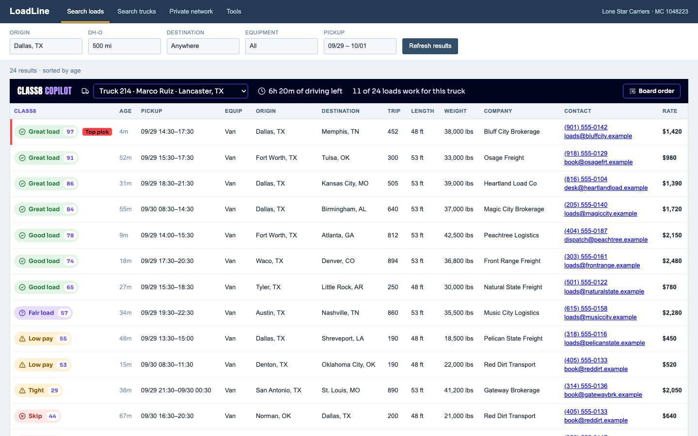
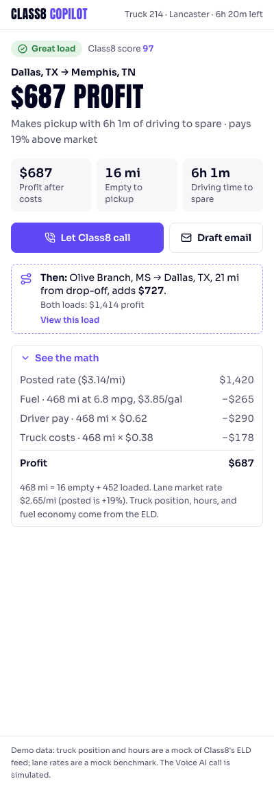
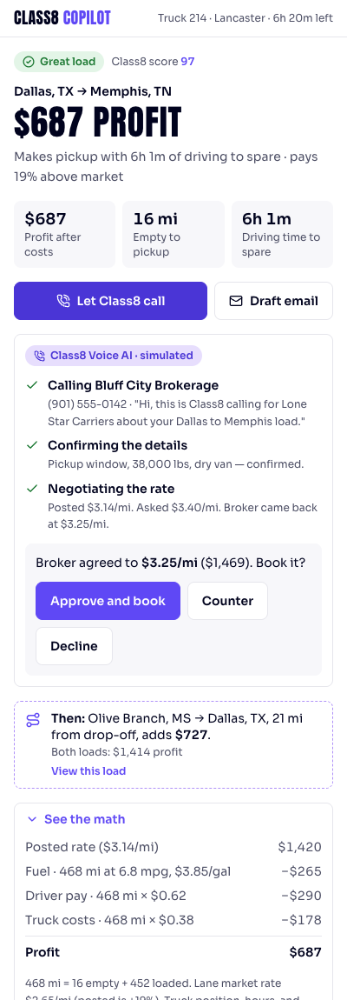
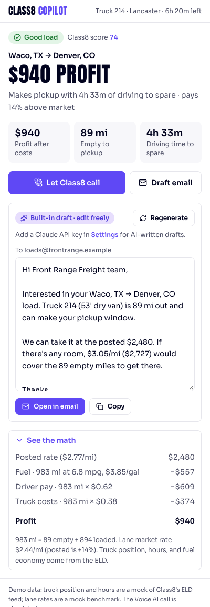

# Class8 Copilot

**Class8's front door inside the load board.** Every load-board extension guesses. Class8 knows the truck.



Dispatchers spend their day inside DAT and Truckstop. Extensions like Numeo Spot, Loadex and LoadConnect meet them there, but they only do rate math. They don't know where the truck is, how many driving hours are left, or what that truck burns in fuel.

Class8 does. Its ELD is built into Volvo, Mack and Freightliner trucks. This extension shows what that data makes possible when it sits right inside the load board. It answers one question per load, **"should this truck take it?"**, and hands the dispatcher straight to Class8's products.

| In the extension | Feeds Class8's… |
|---|---|
| A verdict on every row (Great load / Tight / Low pay / Skip), scored from the truck's **live position, driving hours and fuel economy** | **Drive** (embedded ELD) + **Grow** (load optimization) |
| **Let Class8 call**: the broker is called, details are confirmed, the rate is negotiated, and nothing is booked until you approve | **Automate** (Voice AI, $3 per booked load) |
| **Then:** the best next load near the drop-off, so the truck doesn't come home empty | **Scale** (Dispatch AI) |
| An AI-drafted, editable negotiation email | Automate (email path) |

<p>
  
  
  
</p>

## Try it (2 minutes)

```bash
npm install
npm run build          # → .output/chrome-mv3
npm run board          # demo load board on http://localhost:5174
```

1. In Chrome, open `chrome://extensions`, turn on **Developer mode**, click **Load unpacked**, and pick `.output/chrome-mv3`.
2. Click the Class8 icon, then **Open demo load board**.
3. Click any load, or its verdict chip. The side panel opens. Try **Let Class8 call**, then **Approve and book**; the row on the board flips to *Booked*.
4. Switch trucks in the navy bar. Aisha (50 minutes of driving left) and Tomasz (flatbed, ELD offline) see a very different board.

For AI-written emails, open **Settings** and paste a Claude API key. Without one, the built-in draft is used.

## How it works

```
 load board page (LoadLine demo / DAT / Truckstop)
 ┌───────────────────────────────────────────────┐
 │ content script                                │
 │   adapter.parseRow(tr) → Load                 │──┐  user clicks a load
 │   scoreLoad(load, truck, costs) → Fit         │  │
 │   React in shadow roots: Copilot bar + chips  │  │  runtime message
 └───────────────────────────────────────────────┘  ▼
                                    background worker: sidePanel.open()
                                    + selection → storage.session
                                                    ▼
                           side panel (React): verdict · tiles · Voice AI · email · chain
```

- **`src/lib/`**: pure, fully tested logic.
  - `hos.ts`: 11-hour driving limit, 14-hour on-duty window, 10-hour break.
  - `score.ts`: deadhead, fuel, pay and truck costs → net profit, market comparison, score from 0 to 100, verdict and a plain-language reason.
  - `chain.ts`: plans the delivery (including breaks) and finds the best load within 75 mi afterwards.
  - `negotiate.ts`: the target rate and the email.
- **`src/adapters/`**: one small file per load board. `demoBoard.ts` reads columns by header name, not position, and ignores the cells Class8 injects. `dat.ts` is a documented stub; building it needs a real DAT account, and nothing here scrapes DAT.
- **`src/entrypoints/`**: built with WXT (Manifest V3). The content script renders React into shadow roots, so the board's CSS and ours never collide. The side panel, popup and options are React pages.
- **Design**: Class8's own brand tokens (navy `#01031E`, purple `#5F48F5`, coral `#FD4747`, with Anton and Sora bundled locally). Status is always shown with an icon and text, never color alone. Focus is visible, everything works by keyboard, and reduced motion is respected.

The demo board is a neutral stand-in named "LoadLine". Chrome doesn't let extensions inject into their own pages, so the board is a real third-party page that the content script reads.

## Tests

```bash
npm test               # Jest: driving hours, scoring, chaining, negotiation, adapter against the real demo board
npm run build && npm run e2e   # Playwright: loads the built extension, clicks through, runs axe; screenshots → docs/screenshots
```

## What's mocked

Truck position and hours (a stand-in for the ELD feed), lane rates (a stand-in for SONAR / Greenscreens), and the Voice AI call. Everything else is real.

## Next steps

- A DAT One and Truckstop adapter built against real accounts.
- Swap the mock ELD and lane data for Class8's APIs; the scoring functions already take them as inputs.
- A React Native screen where the driver accepts the load that dispatch just booked.

See [docs/AI_WORKFLOW.md](docs/AI_WORKFLOW.md) for how AI was used to build this, and what was reviewed and changed.
